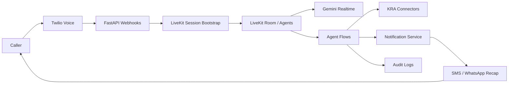
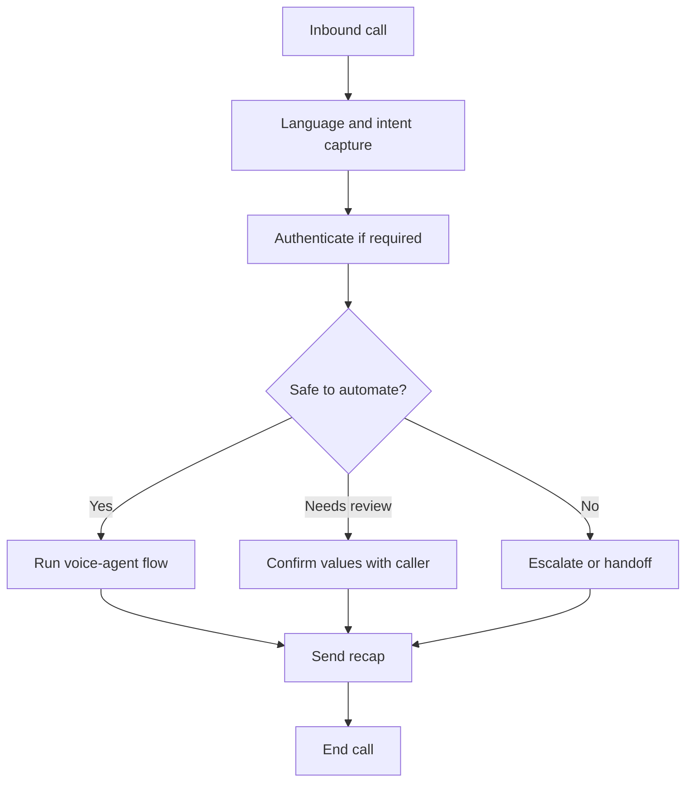

# Pigia Shuru

Pigia Shuru is a voice-first tax assistance backend for Kenyan taxpayers. It is designed to power phone-based tax support flows such as NIL return guidance, Turnover Tax assistance, payment help, and future KRA-integrated workflows.

The current focus of the project is the backend and voice-agent platform.

## Stack
- FastAPI with Python
- Twilio for voice telephony
- LiveKit for WebRTC transport
- LiveKit Agents for session management
- Gemini Realtime for conversational intelligence

## Product Direction
Pigia Shuru is being structured as a voice-agent system that can:
- accept inbound calls from mobile or feature phones
- route sessions through a voice agent
- support English and Kiswahili flows
- confirm critical values before action
- escalate risky or unsupported cases
- send SMS or WhatsApp summaries after calls

## Architecture


The voice path starts at Twilio, enters the FastAPI backend, creates or joins a LiveKit session, and hands conversation control to a LiveKit Agent backed by Gemini Realtime. Business flows then call integrations such as KRA connectors, notifications, and audit logging.

## High-Level Flow


## Project Structure
```text
pigia-shuru/
├── app/
│   ├── api/
│   ├── core/
│   ├── services/
│   ├── integrations/
│   │   ├── twilio/
│   │   ├── livekit/
│   │   ├── gemini/
│   │   └── kra/
│   ├── agents/
│   │   ├── flows/
│   │   ├── prompts/
│   │   ├── tools/
│   │   └── session/
│   ├── models/
│   ├── repositories/
│   ├── workers/
│   ├── utils/
│   └── main.py
├── tests/
├── scripts/
├── docs/
├── deployment/
├── .env.example
├── pyproject.toml
└── README.md
```

More detail is available in [docs/folder-structure.md](./docs/folder-structure.md).

## Documentation
- [Architecture diagram](./docs/architecture-diagram.md)
- [Voice flow](./docs/flow.md)
- [Folder structure](./docs/folder-structure.md)

## Current Entry Point
The FastAPI app starts from [app/main.py](./app/main.py).

Current health endpoint:
- `GET /health`

## Environment Variables
Starter configuration lives in [.env.example](./.env.example).

Planned core variables include:
- `TWILIO_ACCOUNT_SID`
- `TWILIO_AUTH_TOKEN`
- `TWILIO_PHONE_NUMBER`
- `LIVEKIT_URL`
- `LIVEKIT_API_KEY`
- `LIVEKIT_API_SECRET`
- `GEMINI_API_KEY`
- `GEMINI_REALTIME_MODEL`

## Backend Responsibilities
The backend is expected to handle:
- Twilio webhooks for inbound voice events
- LiveKit room and participant orchestration
- Gemini Realtime session setup
- agent flow execution and confirmation logic
- downstream integrations such as KRA-facing connectors
- audit logging, retries, and notification delivery

## Next Build Targets
- add FastAPI routers for webhooks and internal APIs
- scaffold Twilio inbound voice handling
- add LiveKit session bootstrap utilities
- create Gemini Realtime adapter services
- define the first voice-agent flows for NIL return and TOT guidance
