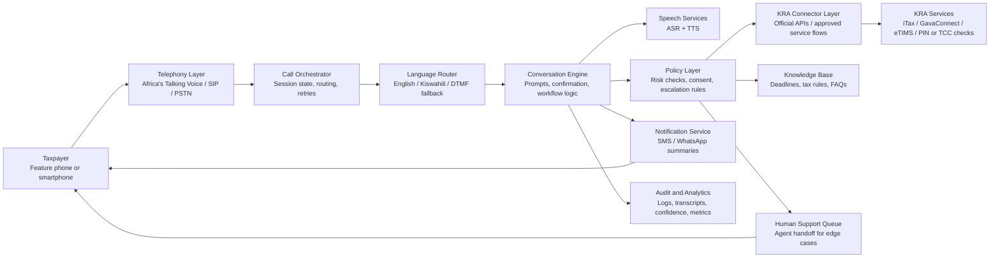

# Pigia Shuru Architecture Diagram

## Overview
Pigia Shuru is a voice-first tax assistance platform designed for Kenyan taxpayers. The system accepts inbound calls, guides users through tax-related workflows, integrates with official KRA channels where available, and falls back to SMS, WhatsApp, or human support when needed.

## Architecture Diagram

## Core Components
### 1. Telephony Layer
- Receives inbound calls from Kenyan mobile and feature phones.
- Connects via Africa's Talking Voice, SIP trunking, or another PSTN provider.
- Supports keypad input when speech recognition confidence is low.

### 2. Call Orchestrator
- Creates and tracks call sessions.
- Routes calls by intent, language, and confidence level.
- Handles retries, timeouts, and resumable handoffs.

### 3. Conversation Engine
- Runs the voice workflow for tasks like NIL return assistance, TOT guidance, PIN verification, and payment help.
- Reads back critical values before action is taken.
- Keeps prompts short and easy to follow over a phone call.

### 4. Speech Services
- Converts speech to text and text to speech.
- Prioritizes Kenyan English and Kiswahili support in MVP.
- Falls back to DTMF if the call environment is noisy.

### 5. Policy Layer
- Decides whether a request is safe to answer directly, needs confirmation, or must be escalated.
- Enforces consent, auditability, and high-risk workflow restrictions.
- Prevents unsupported filing actions from being executed automatically.

### 6. KRA Connector Layer
- Integrates only with official KRA channels and approved APIs.
- Supports read-only lookups first, then assisted submission where officially available.
- Keeps a clean boundary between user-facing voice flows and regulated tax actions.

### 7. Notification Service
- Sends SMS or WhatsApp summaries after calls.
- Shares payment steps, due dates, ticket IDs, or handoff links.
- Reduces the need for callers to memorize spoken instructions.

### 8. Human Support Queue
- Handles ambiguous, high-risk, or failed automated flows.
- Allows smooth transfer from bot to agent with context preserved.
- Useful for annual return edge cases and disputed values.

### 9. Audit and Analytics
- Stores transcripts, confirmations, call outcomes, and confidence scores.
- Supports compliance reviews and product improvement.
- Tracks completion rate, escalation rate, and repeated failure points.

## Suggested MVP Scope
- Inbound voice support for NIL return guidance
- Turnover Tax estimate and reminder flow
- PIN or certificate status checks where officially supported
- SMS recap after each interaction
- Human handoff for uncertain or high-risk cases
