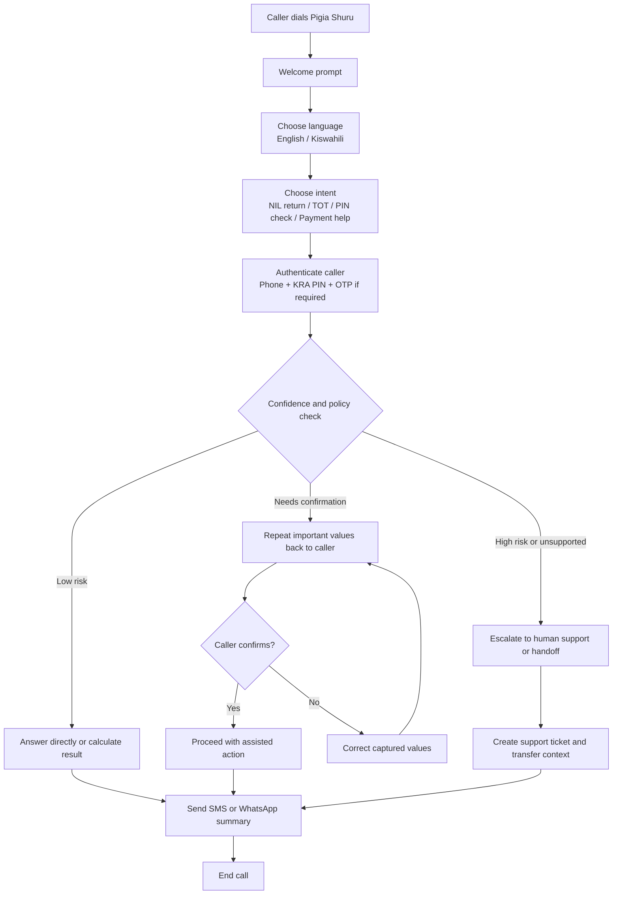
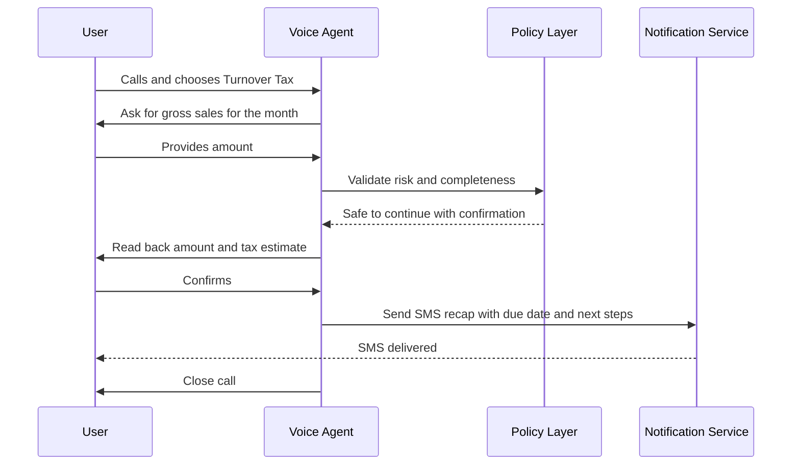

# Pigia Shuru Call Flow

## Primary User Flow

## Detailed Flow
### 1. Entry
- The caller places a call to the Pigia Shuru number.
- The system answers with a short welcome prompt.
- The caller selects English or Kiswahili.

### 2. Intent Capture
- The assistant asks what the caller needs help with.
- The caller can speak or use keypad input.
- Initial MVP intents:
  - NIL return help
  - Turnover Tax guidance
  - PIN or compliance status check
  - Payment instructions

### 3. Authentication
- For basic FAQs, no authentication is required.
- For account-specific actions, the assistant requests:
  - phone number confirmation
  - KRA PIN
  - OTP or another approved verification step

### 4. Workflow Handling
- For low-risk requests:
  - give direct answers
  - provide deadlines
  - compute estimates such as TOT from user-supplied sales
- For medium-risk requests:
  - read values back
  - request explicit spoken confirmation
  - proceed only after confirmation
- For high-risk or unsupported requests:
  - do not automate submission
  - transfer to an agent or provide a secure handoff path

### 5. Notification and Closure
- Send a summary by SMS or WhatsApp after the call.
- Include due date, amount, next action, and reference number where relevant.
- End the call only after confirming the recap was sent.

## Example TOT Flow

## Escalation Rules
- Escalate when speech confidence is low after retry.
- Escalate when a caller disputes calculated values.
- Escalate when the request involves unsupported filing actions.
- Escalate when the caller requests a live agent.

## MVP Success Criteria
- Caller completes a basic flow in under 3 minutes.
- SMS recap is delivered successfully after the call.
- Human handoff preserves call context.
- All critical values are confirmed before action.
